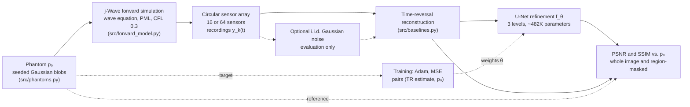
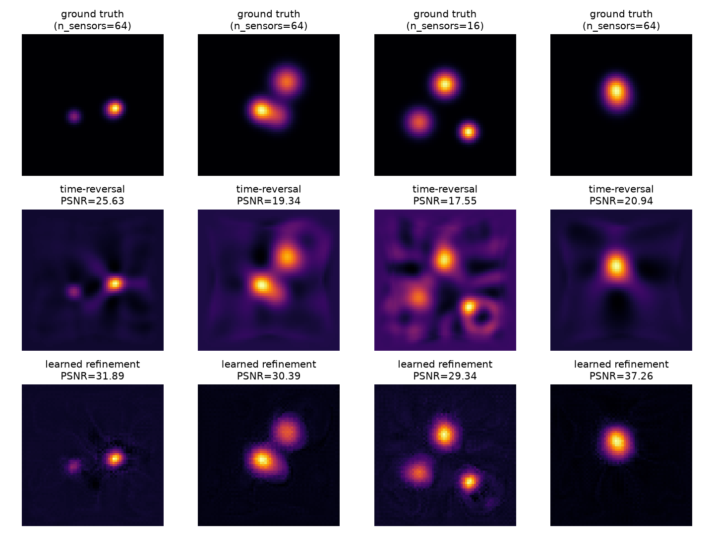
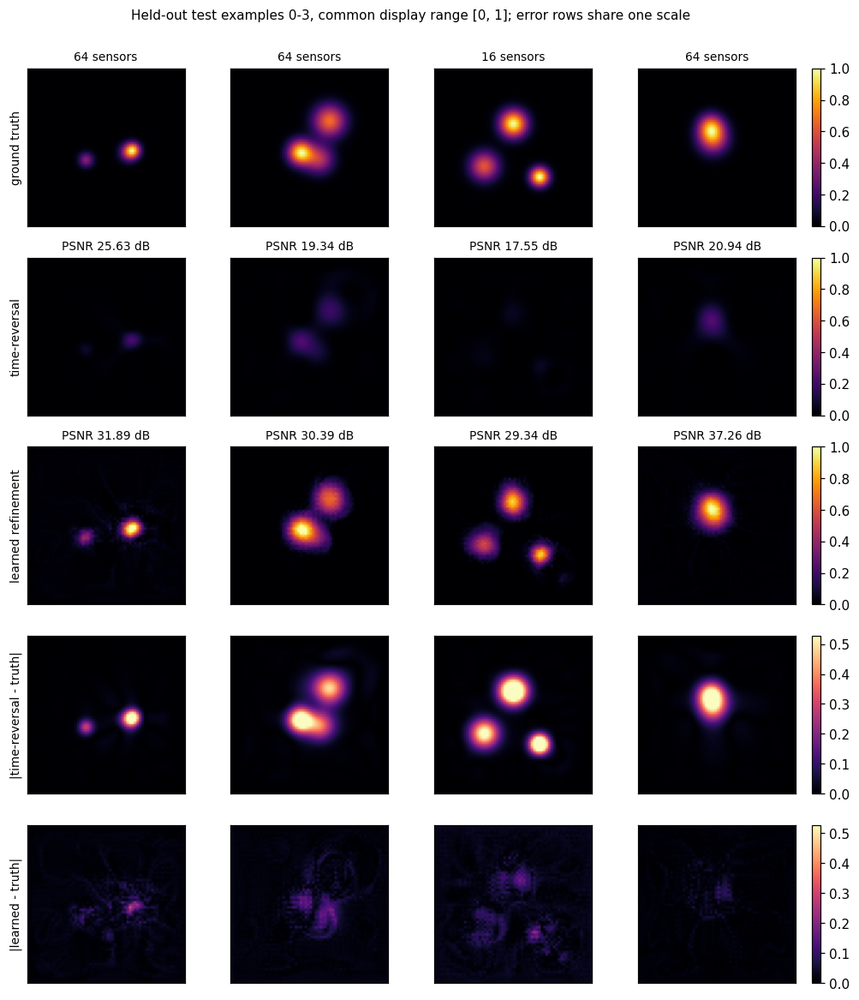
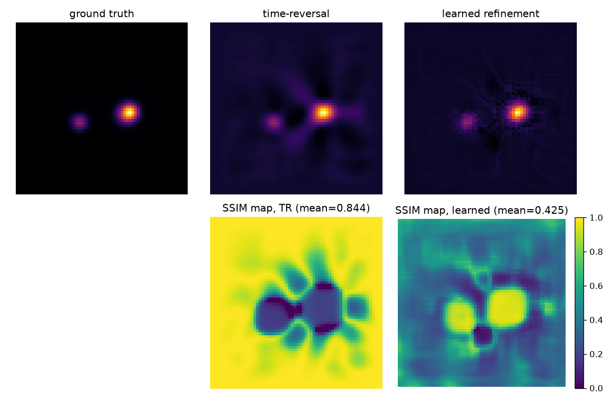
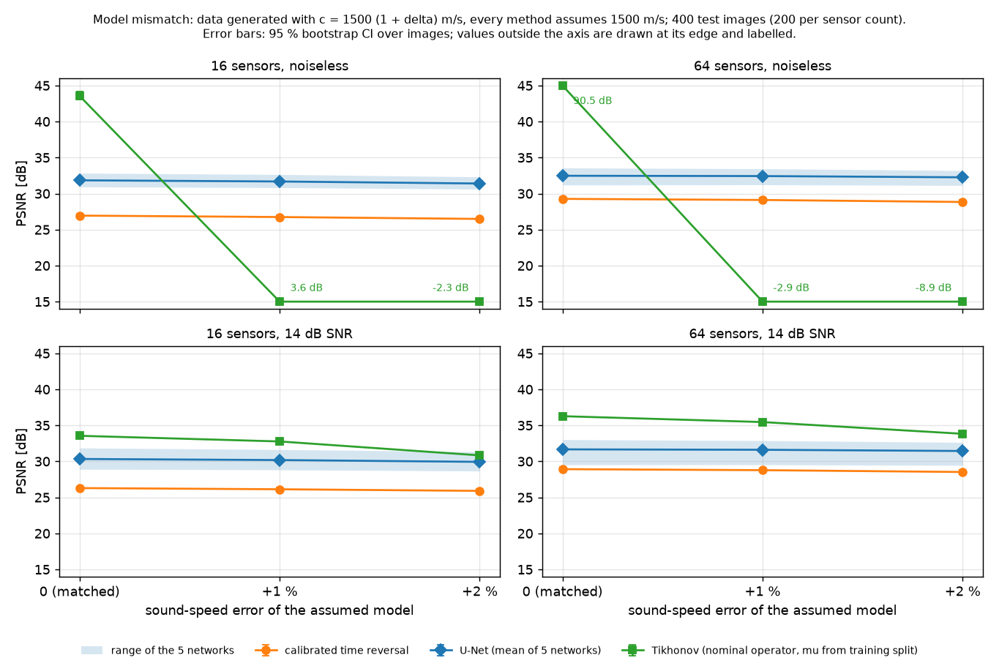
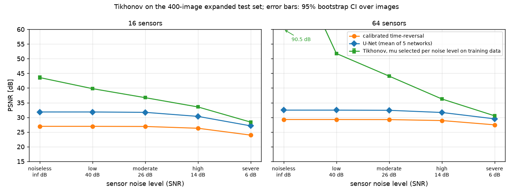
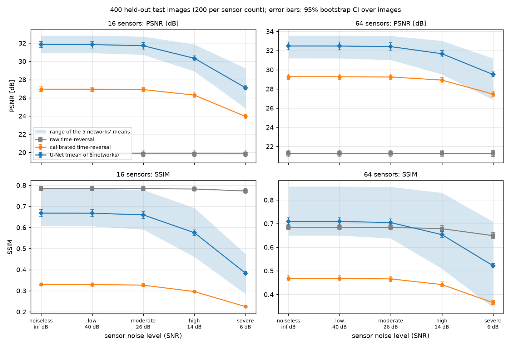

# Photoacoustic Reconstruction: Model-Based vs. Learned Inversion Under Sparse-View Sensing

A comparative study of time-reversal, Tikhonov-regularised inversion and a learned U-Net
refinement for photoacoustic (optoacoustic) tomography, evaluated on synthetic phantom data under
sparse-view sensor arrays.

## Overview

Photoacoustic tomography reconstructs an initial pressure distribution (an optical absorber map)
from acoustic pressure signals recorded by a sensor array. Under sparse-view sensing, where only a
few sensors are available, classical model-based reconstruction produces pronounced streak
artefacts. This project implements a full synthetic pipeline (phantom generation, forward wave
simulation, sparse sensing, reconstruction, evaluation) and compares time-reversal, a
Tikhonov-regularised inversion of the forward model, and a U-Net that refines the time-reversal
estimate, across two sensor-array densities and five sensor-noise levels.

## Summary of findings

All results are on synthetic data (one phantom family, a 64 × 64 grid, 16 and 64 sensors), with
400 test images and 5 independently trained U-Nets; details and uncertainties are under Results.

- **U-Net vs. time-reversal.** After calibrating time-reversal's amplitude on training data, the
  U-Net improves PSNR by 4.9 dB (16 sensors) and 3.2 dB (64 sensors), with 95 % intervals well above
  zero. Its advantage shrinks as sensor noise grows, and results vary by about 2 dB between
  identically trained networks.
- **Tikhonov vs. U-Net.** A Tikhonov inversion whose regularisation weight is chosen for the noise
  level (on training data) outperforms the average U-Net at every tested noise level. This holds
  when the data are generated by exactly the forward model Tikhonov inverts and the noise level is
  known; the noiseless values (43.6 and 90.5 dB) reflect exact inversion of such data, not expected
  reconstruction quality.
- **Model error.** With a 1 to 2 % error in the assumed sound speed, Tikhonov tuned for noisy data
  keeps a smaller PSNR lead at 14 dB SNR (at 2 % with 16 sensors the U-Net is ahead in SSIM), and
  Tikhonov tuned for noiseless data fails. Other kinds of model error, and measured data, were not
  tested.

## Problem Formulation

The forward problem: an initial pressure distribution $p_0(\mathbf{x})$ propagates as an acoustic
wave governed by the constant-speed-of-sound wave equation

$$\frac{1}{c^2}\frac{\partial^2 p(\mathbf{x},t)}{\partial t^2} - \nabla^2 p(\mathbf{x},t) = 0,
\qquad p(\mathbf{x},0) = p_0(\mathbf{x}), \qquad \partial_t p(\mathbf{x},0) = 0,$$

recorded at sensor locations $\{\mathbf{x}_k\}_{k=1}^{K}$ as time series $y_k(t) = p(\mathbf{x}_k, t)$.
The inverse problem is to recover $p_0$ from $\{y_k(t)\}$.

Two reconstruction approaches are compared:

- **Time-reversal** (implemented): the standard model-based inversion for this problem class, the
  wave-equation analogue of filtered back-projection. Degrades under sparse/limited-view sensing.
- **Learned reconstruction** (implemented): a U-Net $f_\theta$ trained to refine the time-reversal
  estimate, $\hat{p}_0^{\text{learned}} = f_\theta(\hat{p}_0^{\text{TR}})$, trained on paired
  (time-reversal estimate, ground-truth phantom) examples.

- **Tikhonov-regularised inversion** (implemented): $\hat{p}_0 = \arg\min_{p_0} \|A p_0 - y\|_2^2 +
  \lambda \|p_0\|_2^2$, zeroth-order (L2) Tikhonov with no positivity constraint, where $A$ is the
  discrete forward simulation written as a matrix; see "Tikhonov-regularised inversion" below.

## Methodology

- **Forward simulation**: [j-Wave](https://github.com/ucl-bug/jwave), a JAX-based differentiable
  acoustic wave simulator (Stanziola et al., *j-Wave: An open-source differentiable wave
  simulator*, SoftwareX, arXiv:2207.01499), run on CPU with a PML absorbing boundary and a
  CFL-derived time step.
- **Phantoms** (`src/phantoms.py`): reproducible, seeded random Gaussian-blob absorbers. A
  Shepp-Logan-style phantom was considered but not used, since it models CT X-ray attenuation
  rather than a localised optical absorber; randomly placed Gaussian blobs give a physically
  reasonable family of distinct phantom instances for train/val/test splits.
- **Sensor arrays**: circular arrays of 16 or 64 sensors.
- **Classical baselines**: time-reversal reconstruction via j-Wave's photoacoustic simulation
  workflow (`src/baselines.py`), scored raw and with a training-set amplitude calibration
  (`src/calibration.py`); and Tikhonov-regularised least squares through an explicit matrix of the
  forward simulation (`src/tikhonov.py`).
- **Learned model** (`src/reconstruction_net.py`): a compact 3-level U-Net (base width 16, about
  482K parameters) mapping the time-reversal estimate to a refined reconstruction, trained by MSE
  regression.

The synthetic pipeline. The ground-truth phantom is used to simulate the recordings, as the
regression target for training, and for scoring; the time-reversal step receives only the
recordings and the sensor geometry:



## Experimental Setup

**Data** (`scripts/generate_training_data.py`): synthetic Gaussian-blob phantoms on a 64 × 64 grid,
40 training and 8 validation examples, each randomly assigned one of the two sensor counts (16 or 64).
A single U-Net is trained across both settings rather than one model per sparsity level.

**Training** (`scripts/train.py`): Adam optimiser, MSE loss, 60 epochs, batch size 8, best-validation
checkpointing.

**Evaluation** (`scripts/expanded_evaluation.py`, the source of every headline number below):
- 400 held-out test phantoms generated exactly like the training data, with seeds disjoint from the
  training and validation splits and exactly 200 per sensor count;
- the U-Net recipe above trained 5 times (seeds 0 to 4, CPU, deterministic), so results reflect
  the method rather than one lucky or unlucky network;
- time-reversal both raw and with a training-set amplitude calibration (below);
- PSNR and SSIM against the phantom (data range 1), with 95% bootstrap confidence intervals over
  test images, and the spread between the 5 trained networks reported separately.

An earlier evaluation used 8 test images and one network (`scripts/evaluate_mvp.py`,
`report/mvp_results.txt`); its numbers are superseded by the expanded evaluation.

## Results

### Amplitude calibration of time-reversal

PSNR and SSIM compare against phantoms in $[0,1]$, but raw time-reversal output peaks at only about
0.06 to 0.24, so the raw comparison mostly measures missing amplitude. Time-reversal is linear in the
recording, so one gain per sensor count corrects it. The gain is fitted by least squares on the
**training** split (`src/calibration.py`) and applied unchanged to every test image and noise level:

| Sensors | Training-split gain (95% CI, bootstrap over training images) | Validation-split gain | Test-set gain (oracle, for reference only) |
|---|---|---|---|
| 16 | 14.68 (14.23 to 15.23), 16 images | 14.65, 5 images | 14.31 |
| 64 | 3.68 (3.59 to 3.78), 24 images | 4.09, 3 images | 3.68 |

The training gain agrees with the gain an oracle would fit on the test set, so calibration transfers.
The validation gain at 64 sensors rests on 3 images.

### Reconstruction quality (noiseless recordings)

400 test images; mean with 95% bootstrap CI over images. U-Net: mean of the 5 trained networks per
image, with the range of the 5 networks' own means in brackets
(`report/expanded_eval_results.txt`):

| Sensors | Metric | Raw time-reversal | Calibrated time-reversal | U-Net (5 networks) | U-Net minus calibrated TR (paired) |
|---|---|---|---|---|---|
| 16 | PSNR | 19.86 dB [19.56, 20.16] | 26.94 dB [26.70, 27.18] | 31.84 dB [31.48, 32.21] (networks 30.93 to 32.84) | +4.90 dB [4.55, 5.23] |
| 64 | PSNR | 21.29 dB [20.98, 21.60] | 29.27 dB [28.98, 29.56] | 32.48 dB [32.09, 32.88] (networks 31.19 to 33.57) | +3.21 dB [2.84, 3.59] |
| 16 | SSIM | 0.784 [0.774, 0.794] | 0.329 [0.323, 0.336] | 0.668 [0.650, 0.685] (networks 0.607 to 0.785) | +0.339 [0.320, 0.358] |
| 64 | SSIM | 0.684 [0.673, 0.697] | 0.468 [0.457, 0.478] | 0.709 [0.694, 0.725] (networks 0.650 to 0.857) | +0.242 [0.220, 0.263] |

- Against calibrated time-reversal the U-Net gains 4.9 dB (16 sensors) and 3.2 dB (64 sensors). Most
  of the 11 to 12 dB gap against raw time-reversal is amplitude scale.
- Which network is trained matters about as much as the test-image sampling: the 5 networks' mean
  PSNR spans about 2 dB, several times the width of the image-level confidence interval. The single
  network used in earlier versions of this README (32.83 and 33.43 dB here) is at the top of that
  range.
- Raw time-reversal has the highest whole-image SSIM at 16 sensors because its near-zero background
  matches the phantom background; calibrated time-reversal has the lowest, since scaling it up also
  amplifies its artefacts. The U-Net is above calibrated time-reversal on SSIM at both sensor counts.

The figures below come from the original network on four examples of the original 8-image test
set; they illustrate the artefacts, not the statistics above.



*Four examples from the original test set (sensor count in each column title). Ground truth is shown
on $[0,1]$, but each reconstruction panel is auto-scaled to its own range, which makes structure
visible and hides amplitude. Time-reversal shows streak and ring artefacts, strongest in the
16-sensor example; the learned refinement removes most of them but leaves a faint textured
background.*



*The same four examples with every intensity panel on the fixed $[0,1]$ range that PSNR and SSIM
use, and both error rows on one colour scale (`scripts/plot_comparison_shared_scale.py`). Raw
time-reversal's error is mostly missing amplitude on the absorbers; the learned model's error is
small and spread over the background. This figure needs the local, gitignored dataset and original
checkpoint.*

A region-masked breakdown for one example (`report/mvp_ssim_diagnosis.png`) shows where the learned
model loses SSIM: within the true phantom structure its SSIM is far higher than raw time-reversal's
(0.936 vs. 0.188), but in the background, about 96% of the image, raw time-reversal scores higher
(0.870 vs. 0.405) because the learned model leaves a faint haze there.

<p align="center">
  
</p>

*Local SSIM maps for one test example. Time-reversal scores near 1 in the flat background but low on
the absorbers; the learned model scores high on the absorbers and lower across the background.*

### Tikhonov-regularised inversion

`src/tikhonov.py` solves $\min_p \|A p - y\|^2 + \lambda \|p\|^2$ with $\lambda = \mu \|A^T A\|$,
where $A$ is the forward simulation written as an explicit matrix (one simulation per pixel, 4096
per sensor geometry) and the normal equations are solved directly. The adjoint was not taken from
automatic differentiation because neither `jax.vjp` nor `jax.linear_transpose` through j-Wave
satisfies the adjoint identity here (relative errors 0.25 to 0.5). `tests/test_tikhonov.py` checks
that the matrix reproduces the forward simulation, the adjoint identity, the gradient against
finite differences, and that the solution satisfies the normal equations.

$\mu$ is chosen per sensor count on the **training** split by mean PSNR over $\mu = 10^{-12}$ to
$10^{1}$ (`scripts/tikhonov_evaluation.py`, `report/tikhonov_results.txt`). Two protocols:
(1) one $\mu$ chosen on noiseless training data and used at every noise level, the analogue of the
noiselessly trained U-Net; (2) $\mu$ chosen per noise level on training recordings with the same
noise level, using noise draws independent of the test set. The first grid, $10^{-9}$ to $10^{-1}$,
put two selections at its edges; it was widened on that basis alone, and the per-noise-level results
changed by at most 0.07 dB. The test recordings are exactly those used for the other methods.

| Sensors | Noise | Tikhonov PSNR, $\mu$ per noise level | U-Net PSNR (5 networks) | Tikhonov minus U-Net (paired) |
|---|---|---|---|---|
| 16 | noiseless | 43.56 dB [43.03, 44.16] | 31.84 dB | +11.72 dB [11.26, 12.22] |
| 64 | noiseless | 90.51 dB [90.17, 90.86] | 32.48 dB | +58.04 dB [57.62, 58.47] |
| 16 | high (14 dB SNR) | 33.55 dB [33.34, 33.75] | 30.33 dB | +3.22 dB [2.98, 3.47] |
| 64 | high (14 dB SNR) | 36.27 dB [35.96, 36.61] | 31.67 dB | +4.61 dB [4.26, 4.96] |
| 16 | severe (6 dB SNR) | 28.38 dB [28.11, 28.64] | 27.10 dB | +1.28 dB [1.07, 1.50] |
| 64 | severe (6 dB SNR) | 30.53 dB [30.23, 30.84] | 29.50 dB | +1.02 dB [0.78, 1.28] |

- With $\mu$ matched to the noise level, Tikhonov beats the average U-Net at every noise level and
  both sensor counts, by a margin that shrinks as noise grows. At the severe level the best of the 5
  networks (29.24 and 31.18 dB) is above Tikhonov, so there the ranking depends on the network.
- With $\mu$ chosen on noiseless data, Tikhonov fails under any noise (PSNR below 15 dB even at
  40 dB SNR): the noiseless choice is essentially unregularised. Its performance depends entirely on
  choosing $\lambda$ for the noise level.
- These synthetic data are generated by exactly the operator Tikhonov inverts, with no modelling
  error (an "inverse crime"). The 64-sensor noiseless result, an essentially exact reconstruction,
  shows that the discretised 64-sensor problem is nearly invertible, not that Tikhonov would reach
  that quality on measured data. With model mismatch Tikhonov's advantage would shrink by an
  unknown amount; the model-mismatch check below measures it for one physical parameter.
- The comparison is not symmetric in what each method is told: the per-noise-level weight uses the
  test noise level, which is known in simulation, while the U-Net is trained once on noiseless data.
- Against individual networks the picture is less uniform than against their average: at the severe
  level Tikhonov's PSNR is above 4 of the 5 networks at 16 sensors and 3 of 5 at 64, and its SSIM at 16
  sensors is above only 2 of 5 (mean difference -0.003 [-0.016, +0.010]).
- Why 90.5 dB: with 64 sensors the 19,008 x 4,096 matrix has full numerical column rank (condition
  number about $1.3\times10^{8}$; 216 of its 4,096 singular values are below $10^{-6}$ of the largest),
  and the noiseless test recordings are reproduced by $A$ to about $10^{-6}$ relative error, so a nearly
  unregularised solve recovers the phantom almost exactly. With 16 sensors $A$ is far worse conditioned
  (condition number about $3\times10^{10}$; 2,334 of 4,096 singular values below $10^{-6}$ of the
  largest), and the weakly regularised solution suits these smooth blob phantoms
  (`report/tikhonov_diagnostics.txt`, `scripts/tikhonov_diagnostics.py`).

### Model mismatch

`scripts/model_mismatch_evaluation.py` generates the 400 test recordings with a true sound speed
$c = 1500\,(1+\delta)$ m/s, $\delta \in \{0, 1\%, 2\%\}$ (water changes by about 2 % over roughly 10 °C;
soft tissue is about 1540 m/s), sampled on the nominal time axis, while every method keeps assuming
1500 m/s: the time-reversal gains, the 5 U-Nets, and Tikhonov with the nominal matrix and the weight
already selected on the training split. Nothing is refitted. The protocol and mismatch levels were
fixed before any result was seen, and $\delta = 0$ reproduces the saved results exactly
(`report/model_mismatch_results.txt`).

| Sensors | Noise | $\delta$ | Calibrated TR PSNR | U-Net PSNR (5 networks) | Tikhonov PSNR | Tikhonov minus U-Net, PSNR | Tikhonov minus U-Net, SSIM |
|---|---|---|---|---|---|---|---|
| 16 | noiseless | 0 / 1 % / 2 % | 26.94 / 26.75 / 26.48 | 31.84 / 31.68 / 31.40 | 43.56 / 3.56 / -2.33 | +11.72 / -28.12 / -33.73 | +0.271 / -0.636 / -0.645 |
| 64 | noiseless | 0 / 1 % / 2 % | 29.27 / 29.11 / 28.84 | 32.48 / 32.43 / 32.26 | 90.51 / -2.95 / -8.87 | +58.04 / -35.38 / -41.13 | +0.291 / -0.646 / -0.682 |
| 16 | high (14 dB SNR) | 0 / 1 % / 2 % | 26.29 / 26.13 / 25.90 | 30.33 / 30.18 / 29.93 | 33.55 / 32.77 / 30.83 | +3.22 / +2.58 / +0.90 | +0.064 / +0.021 / -0.064 |
| 64 | high (14 dB SNR) | 0 / 1 % / 2 % | 28.92 / 28.78 / 28.53 | 31.67 / 31.61 / 31.44 | 36.27 / 35.46 / 33.83 | +4.61 / +3.85 / +2.39 | +0.122 / +0.093 / +0.049 |

(PSNR in dB, means over 200 test images per sensor count; 95 % intervals and per-network ranges are in
the results file. Every Tikhonov-minus-U-Net interval excludes zero.)



- The noiseless collapse is a regularisation-choice failure, not a failure of the method: the weight
  selected on matched noiseless training data is essentially zero, and model error then acts like
  unregularised noise. As a diagnostic only (the weight chosen on the test set itself, which is not a
  valid result), Tikhonov can reach about 35.0 and 41.5 dB at 1 % and 32.1 and 37.3 dB at 2 %
  (16 and 64 sensors, 100 test images each; `report/tikhonov_diagnostics.txt`), still above the U-Net but
  by far less than with matched data.
- At 14 dB SNR the noise-level weight is large enough to absorb this mismatch, and Tikhonov keeps a
  smaller PSNR lead. At 2 % and 16 sensors the U-Net's SSIM is higher and the best network's PSNR is
  0.5 dB above Tikhonov's, so the ordering depends on the metric and on the network.
- One mismatch type (sound speed) at two small levels; errors in sensor positions, discretisation,
  attenuation or heterogeneous media were not tested.



*PSNR on the 400 test images at each noise level; Tikhonov uses $\mu$ selected per noise level on
training data. The noiseless 64-sensor Tikhonov value (90.5 dB) is off the scale.*

## Key Findings

- On 400 test images, a U-Net refinement improves on amplitude-calibrated time-reversal by 4.9 dB
  (16 sensors) and 3.2 dB (64 sensors) in PSNR; most of the raw 11 to 12 dB gap is amplitude.
- Training variability is substantial: the mean PSNR of 5 identically configured networks spans about
  2 dB, a larger uncertainty than the image-level confidence interval, so single-network results
  should not be over-read.
- With the exact forward operator (an inverse crime) and its weight tuned on training data for the
  known noise level, Tikhonov inversion beats the average U-Net in PSNR at every noise level and in
  SSIM at every level except the most severe with 16 sensors, where the two are indistinguishable.
  The noiseless Tikhonov values (43.6 and 90.5 dB) reflect exact inversion of data generated by the
  same operator, not reconstruction quality.
- Under a 1 to 2 % error in the assumed sound speed, Tikhonov with the weight tuned for noisy data
  still leads the U-Net in PSNR at 14 dB SNR, but by less (16 sensors: 3.2, 2.6 and 0.9 dB at 0, 1 and
  2 %), and at 2 % with 16 sensors the best of the 5 networks is ahead of it in PSNR and the average network in SSIM. With the
  weight tuned for noiseless matched data, Tikhonov fails under the same mismatch. Time reversal and
  the U-Net change by less than 0.5 dB.
- Everything here is synthetic (one phantom family, two sensor counts, one simulator); it
  characterises this setup, not photoacoustic reconstruction in general.

## Noise Robustness

The U-Net is trained only on noiseless reconstructions. `scripts/expanded_evaluation.py` adds i.i.d.
Gaussian noise to the simulated sensor recordings at evaluation time, with standard deviation
relative to each recording's RMS amplitude, and scores the same 400 images and 5 networks at each
level. Calibrated time-reversal uses the same noiseless-training gains at every level.



*Error bars: 95% bootstrap CI over the 200 test images per sensor count. Shaded band: range of the 5
trained networks' mean scores (`report/expanded_eval_results.txt`).*

| Sensors | Noise | Calibrated TR PSNR | U-Net PSNR (5 networks) | Change from noiseless: calibrated TR | Change from noiseless: U-Net |
|---|---|---|---|---|---|
| 16 | high (14 dB SNR) | 26.29 dB | 30.33 dB (networks 28.90 to 31.86) | -0.65 dB | -1.51 dB |
| 16 | severe (6 dB SNR) | 23.95 dB | 27.10 dB (networks 24.85 to 29.24) | -3.00 dB | -4.74 dB |
| 64 | high (14 dB SNR) | 28.92 dB | 31.67 dB (networks 29.52 to 33.02) | -0.35 dB | -0.81 dB |
| 64 | severe (6 dB SNR) | 27.46 dB | 29.50 dB (networks 26.87 to 31.18) | -1.81 dB | -2.97 dB |

- The U-Net degrades faster than calibrated time-reversal, losing 1.6 to 2.3 times as many dB, so its
  PSNR lead shrinks with noise: at 6 dB SNR it is 3.15 dB [2.94, 3.36] at 16 sensors and 2.05 dB
  [1.78, 2.30] at 64.
- The averaged lead holds at every level, but not for every network: at 6 dB SNR with 64 sensors
  one of the 5 networks is 0.59 dB below calibrated time-reversal. The spread between networks grows
  with noise.
- Raw time-reversal PSNR barely changes with noise because its error is dominated by missing
  amplitude, not because it suppresses noise.
- This is an evaluation-time check with one noise model (i.i.d. Gaussian) and networks trained
  without noise; it says nothing about correlated noise, other noise levels, or noise-aware training.

## Repository Structure

```
photoacoustic-reconstruction/
├── README.md
├── ARCHITECTURE.md          mathematical formulation and design notes
├── requirements.txt
├── src/
│   ├── phantoms.py          synthetic Gaussian-blob phantom generation
│   ├── forward_model.py     j-Wave acoustic forward simulation and sparse sensing
│   ├── baselines.py         time-reversal reconstruction
│   ├── reconstruction_net.py  U-Net refinement model
│   ├── evaluate.py          PSNR/SSIM evaluation
│   ├── calibration.py       training-set amplitude calibration of time-reversal
│   ├── tikhonov.py          Tikhonov inversion via an explicit forward matrix
│   └── stats.py             bootstrap confidence intervals over test images
├── scripts/
│   ├── smoke_test.py            forward-model sanity check
│   ├── generate_training_data.py  builds train/val/test splits
│   ├── train.py                  trains the U-Net (--seed, --device cpu for exact repeatability)
│   ├── expanded_evaluation.py    400-image, 5-network evaluation at all noise levels (headline results)
│   ├── tikhonov_evaluation.py    Tikhonov selection on training data and evaluation on the same test set
│   ├── tikhonov_diagnostics.py   conditioning of the forward matrices and the oracle-weight diagnostic
│   ├── model_mismatch_evaluation.py  all methods under a 1 to 2 % sound-speed error in the data
│   ├── evaluate_mvp.py           original 8-image PSNR/SSIM comparison
│   ├── plot_comparison_shared_scale.py  comparison figure on a common display range
│   ├── evaluate_calibrated_baseline.py  amplitude-calibrated time-reversal baseline
│   └── evaluate_noise_sensitivity.py  original 8-image noise check (noise model reused by the expanded evaluation)
├── configs/                  mvp.yaml
├── data/                     generated splits, expanded test set, Tikhonov matrices (not committed)
├── experiments/              trained checkpoints (not committed)
├── tests/                    42 tests: phantoms, forward model, baselines, evaluation, calibration, bootstrap, Tikhonov
└── report/                   evaluation figures and results
```

## Installation

Requires Python 3.11. Dependencies are pinned in `requirements.txt`: `numpy`, `scipy`, `matplotlib`,
`scikit-image`, `jax`/`jaxlib`/`jaxdf`, `jwave`, `torch`, `pytest`. The forward simulation runs on
CPU; no GPU is required.

```bash
pip install -r requirements.txt
```

## Usage

```bash
# sanity-check the forward simulation
python scripts/smoke_test.py

# generate the train/val/test splits
python scripts/generate_training_data.py

# train the U-Net refinement model
python scripts/train.py

# run the PSNR/SSIM comparison on the test split
python scripts/evaluate_mvp.py

# the same comparison on a common [0, 1] display range, with error maps
python scripts/plot_comparison_shared_scale.py

# time-reversal with a training-set amplitude calibration (needs the data splits, not the U-Net)
python scripts/evaluate_calibrated_baseline.py

# noise-robustness check: re-evaluate the existing checkpoint under added sensor noise
python scripts/evaluate_noise_sensitivity.py

# headline results: 400 test images, 5 networks trained on CPU, all noise levels (about 8 minutes)
python scripts/expanded_evaluation.py

# Tikhonov baseline on the same test set (after expanded_evaluation.py; about 4 minutes the first
# time, which includes assembling the forward matrices)
python scripts/tikhonov_evaluation.py

# model mismatch: sound speed 1 and 2 % off for the data, every method nominal (about 15 minutes)
python scripts/model_mismatch_evaluation.py
```

## Reproducing the Experiments

The headline results need only `generate_training_data.py`, then `expanded_evaluation.py` and
`tikhonov_evaluation.py`. Both are deterministic: rerunning them reproduces
`report/expanded_eval_*` and `report/tikhonov_*` byte for byte. For the original 8-image evaluation,
run the first four scripts above in order. `evaluate_mvp.py` writes `report/mvp_results.txt`,
`report/mvp_comparison.png`, and `report/mvp_ssim_diagnosis.png`. `evaluate_noise_sensitivity.py`
(see Noise Robustness) requires `experiments/unet_checkpoint.pt` to already exist (from
`train.py`) but does not retrain it; it writes `report/noise_sensitivity_results.txt` and
`report/noise_sensitivity_results.json`.

## Tests

```bash
pytest
```

42 tests cover phantom generation (shape, value range, reproducibility, seed sensitivity), the
forward model (recording shape/finiteness, non-triviality, causality), the time-reversal baseline
(no ground-truth leakage, reconstruction shape/finiteness, correlation with ground truth, and
degradation under sparser arrays), the evaluation metrics (PSNR/SSIM sanity checks), and the
amplitude calibration (recovers a known gain, is the least-squares minimiser, fits each sensor count
from its own examples only), the bootstrap intervals (coverage close to the normal-theory width,
pairing removes between-image spread), and the Tikhonov solver (the matrix reproduces the forward
simulation, adjoint identity, gradient against finite differences, normal equations, regularisation
behaviour), and the evaluation protocol (disjoint seed ranges for every split, the 200/200 sensor
allocation, calibration gains that match a training-only fit, and a Tikhonov weight that is the
argmax of the training scores). The Tikhonov gradient is checked by central differences at several
random points, weights and step sizes.

## Limitations

- All data are synthetic. Except in the model-mismatch check, the test data are generated by the same
  discrete forward model that time-reversal and Tikhonov use, which favours the model-based methods,
  Tikhonov most of all. The mismatch check covers one parameter (sound speed, 1 to 2 %); the effect on
  measured data is unknown.
- One phantom family (random Gaussian blobs), one grid size (64 × 64) and two sensor counts; results
  have not been checked on other phantom types, larger grids or a finer sparsity sweep.
- The U-Net is trained on 40 examples and selected on 8 validation examples. Its results vary by
  about 2 dB between identically configured training runs, and 3 of the 5 networks select their
  checkpoint at the last of the 60 epochs, so validation loss was still falling and the networks may be
  under-trained. A larger training set or longer training may narrow the spread; neither was tried.
- Tikhonov's advantage depends on choosing its weight for the noise level. Here the noise level is
  known in simulation; with an unknown noise level the weight would need to be estimated.
- Noise is i.i.d. Gaussian, added at evaluation time only, with networks trained without noise. No
  noise-aware training, correlated noise or measured noise statistics were studied.
- The learned model leaves a faint background haze that lowers whole-image SSIM; this is not
  corrected.
- All experiments run on laptop CPU (and MPS for the original network).

## References

Stanziola, A., Arridge, S. R., Cox, B. T., & Treeby, B. E. (2023). *j-Wave: An open-source
differentiable wave simulator.* SoftwareX. arXiv:2207.01499.
