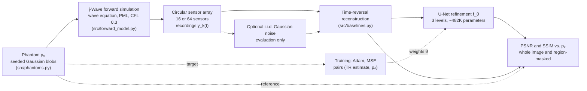

# Photoacoustic Reconstruction: Model-Based vs. Learned Inversion Under Sparse-View Sensing

A comparative study of classical time-reversal reconstruction against a learned U-Net refinement
for photoacoustic (optoacoustic) tomography, evaluated on synthetic phantom data under sparse-view
sensor arrays.

## Overview

Photoacoustic tomography reconstructs an initial pressure distribution (an optical absorber map)
from acoustic pressure signals recorded by a sensor array. Under sparse-view sensing, where only a
few sensors are available, classical model-based reconstruction produces pronounced streak
artefacts. This project implements a full synthetic pipeline (phantom generation, forward wave
simulation, sparse sensing, reconstruction, evaluation) and compares a time-reversal baseline
against a U-Net that refines the time-reversal estimate, across two sensor-array densities.

## Problem Formulation

The forward problem: an initial pressure distribution $p_0(\mathbf{x})$ propagates as an acoustic
wave governed by the constant-speed-of-sound wave equation

$$\frac{1}{c^2}\frac{\partial^2 p(\mathbf{x},t)}{\partial t^2} - \nabla^2 p(\mathbf{x},t) = 0,
\qquad p(\mathbf{x},0) = p_0(\mathbf{x}), \qquad \partial_t p(\mathbf{x},0) = 0,$$

recorded at sensor locations $\{\mathbf{x}_k\}_{k=1}^{K}$ as time series $y_k(t) = p(\mathbf{x}_k, t)$.
The inverse problem is to recover $p_0$ from $\{y_k(t)\}$.

Two reconstruction approaches are compared:

- **Time-reversal** (implemented): the standard model-based inversion for this problem class, the
  wave-equation analogue of filtered back-projection. Degrades under sparse/limited-view sensing.
- **Learned reconstruction** (implemented): a U-Net $f_\theta$ trained to refine the time-reversal
  estimate, $\hat{p}_0^{\text{learned}} = f_\theta(\hat{p}_0^{\text{TR}})$, trained on paired
  (time-reversal estimate, ground-truth phantom) examples.

A Tikhonov-regularised least-squares baseline ($\hat{p}_0 = \arg\min_{p_0} \|A p_0 - y\|_2^2 +
\lambda \|p_0\|_2^2$) is formulated in the codebase's design notes but not implemented; see
Limitations.

## Methodology

- **Forward simulation**: [j-Wave](https://github.com/ucl-bug/jwave), a JAX-based differentiable
  acoustic wave simulator (Stanziola et al., *j-Wave: An open-source differentiable wave
  simulator*, SoftwareX, arXiv:2207.01499), run on CPU with a PML absorbing boundary and a
  CFL-derived time step.
- **Phantoms** (`src/phantoms.py`): reproducible, seeded random Gaussian-blob absorbers. A
  Shepp-Logan-style phantom was considered but not used, since it models CT X-ray attenuation
  rather than a localised optical absorber; randomly placed Gaussian blobs give a physically
  reasonable family of distinct phantom instances for train/val/test splits.
- **Sensor arrays**: circular arrays of 16 or 64 sensors.
- **Classical baseline** (`src/baselines.py`): time-reversal reconstruction via j-Wave's
  photoacoustic simulation workflow.
- **Learned model** (`src/reconstruction_net.py`): a compact 3-level U-Net (base width 16, about
  482K parameters) mapping the time-reversal estimate to a refined reconstruction, trained by MSE
  regression.

The synthetic pipeline. The ground-truth phantom is used to simulate the recordings, as the
regression target for training, and for scoring; the time-reversal step receives only the
recordings and the sensor geometry:



## Experimental Setup

**Dataset** (`scripts/generate_training_data.py`): 56 synthetic examples (40 train, 8 validation,
8 test), generated with deterministic, non-overlapping seed ranges per split. Each example is
randomly assigned one of the two sensor counts (16 or 64), and a single U-Net is trained across
both settings rather than one model per sparsity level.

**Training** (`scripts/train.py`): Adam optimiser, MSE loss, 60 epochs, batch size 8, best-validation
checkpointing, fixed seed. Training loss decreased from 0.0281 to 0.0002 and validation loss from
0.0118 to 0.0005, both monotonically, in about 5 seconds on an Apple Silicon MPS backend.

**Evaluation** (`scripts/evaluate_mvp.py`): PSNR and SSIM between each method's reconstruction and
ground truth on the held-out test split, computed separately for each sensor count (4 test
examples per setting).

## Results

Test set (n = 4 per sparsity setting):

| Sensors | TR PSNR | TR SSIM | Learned PSNR | Learned SSIM |
|---|---|---|---|---|
| 16 | 18.97 dB | 0.706 | 30.73 dB | 0.500 |
| 64 | 22.43 dB | 0.735 | 33.08 dB | 0.517 |

The learned model improves PSNR by 11.8 dB (16 sensors) and 10.6 dB (64 sensors) over time-reversal,
and visibly removes streak artefacts (`report/mvp_comparison.png`). It scores lower on whole-image
SSIM than time-reversal at both sparsity settings.

**Amplitude calibration.** PSNR and SSIM use a fixed data range of 1 against phantoms in $[0,1]$,
but raw time-reversal output peaks at only about 0.06 to 0.24, so the raw comparison also penalises
time-reversal for its amplitude scale. `scripts/evaluate_calibrated_baseline.py` fits a single
least-squares scalar per sensor count on the **training** split (the data the U-Net was trained on)
and applies it unchanged to the test split, so no test information is used
(`report/calibrated_baseline_results.txt`):

| Sensors | TR PSNR, raw | TR PSNR, calibrated | TR SSIM, calibrated | Learned PSNR | Learned SSIM |
|---|---|---|---|---|---|
| 16 | 18.97 dB | 25.96 dB | 0.322 | 30.73 dB | 0.500 |
| 64 | 22.43 dB | 30.95 dB | 0.529 | 33.08 dB | 0.517 |

With calibration the PSNR gain of the learned model falls from 11.8 to 4.8 dB (16 sensors) and from
10.6 to 2.1 dB (64 sensors); most of the raw gap at 64 sensors is amplitude scale. Calibration also
lowers time-reversal's SSIM, because scaling amplifies its background artefacts, so the SSIM ranking
reverses at 16 sensors and is roughly level at 64. A per-image scale fitted against each test ground
truth, an oracle, gains only about 0.15 dB more, so the calibrated baseline is close to the best any
single scale can do. These are 4 test images per setting, and the fitted scale is itself uncertain
(a global scale fitted on the validation split is 4.9 against 4.1 on the training split).


*Four of the eight test examples (sensor count in each column title). Ground truth is shown on
$[0,1]$, but each reconstruction panel is auto-scaled to its own range, which makes structure visible
and hides amplitude. Time-reversal shows streak and ring artefacts, strongest in the 16-sensor
example; the learned refinement removes most of them but leaves a faint textured background.*


*The same four examples, same checkpoint and PSNR values (raw, uncalibrated time-reversal), with
every intensity panel on the fixed $[0,1]$ range that PSNR and SSIM are computed against, and both error rows on one colour scale
(`scripts/plot_comparison_shared_scale.py`). Time-reversal peaks at only 0.06 to 0.24 against a
ground-truth peak of 1, so most of its error is missing amplitude on the absorbers. The learned
model's error is small and spread over the background, the haze discussed below. Like
`report/mvp_comparison.png`, this figure needs the local, gitignored dataset and checkpoint;
from a fresh clone it can only be regenerated after `generate_training_data.py` and `train.py`, and a
retrained model will not match it exactly.*

A region-masked breakdown for one test example (example 0 in `report/mvp_results.txt`; `report/mvp_ssim_diagnosis.png`) illustrates the SSIM discrepancy: within
the true phantom structure, the learned model's SSIM is far higher than time-reversal's (0.936 vs.
0.188), but in the background, which covers about 96% of the image area, time-reversal scores
higher (0.870 vs. 0.405). The learned model introduces a small residual background haze that SSIM's
local-variance sensitivity penalises heavily, and since the background dominates image area, this
inverts the whole-image SSIM ranking despite the large PSNR and visual improvement. This is a known
failure mode of MSE-trained restoration networks rather than an artefact of the evaluation.

<p align="center">
  
</p>

*Local SSIM maps for one test example. Time-reversal scores near 1 in the flat background but low on
the absorbers; the learned model scores high on the absorbers and lower across the background.*

## Key Findings

- The learned refinement network substantially outperforms raw time-reversal on PSNR and visual
  artefact removal at both tested sparsity levels. Against a time-reversal baseline with a
  training-set amplitude calibration, the PSNR gain is smaller (4.8 dB at 16 sensors, 2.1 dB at 64),
  so a large part of the raw gain, especially at 64 sensors, is amplitude scale.
- Whole-image SSIM favours raw time-reversal. In the example analysed region by region, this comes
  from a diffuse background haze in the learned reconstruction, while SSIM restricted to the true
  phantom structure strongly favours the learned model. After amplitude calibration the SSIM ranking
  reverses at 16 sensors and is roughly level at 64.
- The dataset (56 examples total, 8 held out for testing) is small; the results characterise this
  specific synthetic setup and should not be read as general accuracy figures for photoacoustic
  reconstruction.

## Noise Robustness

The headline results above use a noiseless forward simulation (`src/forward_model.py` has no
sensor-noise model), and the U-Net was trained only on noiseless time-reversal reconstructions.
Since real photoacoustic acquisitions are noise-dominated, `scripts/evaluate_noise_sensitivity.py`
adds i.i.d. Gaussian noise to the simulated sensor recordings as an evaluation-time-only option
(the noiseless path used everywhere else is unchanged) and re-runs the **existing, not retrained**
checkpoint at four positive noise levels plus the noiseless baseline, on the full 8-example test
split (16- and 64-sensor settings). Noise standard deviation is expressed relative to each
example's own clean-recording RMS amplitude, with an equivalent SNR shown for reference. Each noisy
time-reversal reconstruction is scored both raw and after the training-set amplitude calibration
described under Results. Time-reversal is linear in the recording, so its gain does not depend on the
noise, and the same noiseless-training gains are applied unchanged; nothing is fitted on noisy or test
data. The U-Net still receives the raw reconstruction, as in training.

| Noise level | Rel. std | SNR (dB) | TR PSNR, raw | TR PSNR, calibrated | U-Net PSNR | TR SSIM, raw | TR SSIM, calibrated | U-Net SSIM |
|---|---|---|---|---|---|---|---|---|
| noiseless | 0.00 | inf | 20.70 dB | 28.45 dB | 31.90 dB | 0.720 | 0.426 | 0.508 |
| low | 0.01 | 40.0 | 20.70 dB | 28.45 dB | 31.90 dB | 0.720 | 0.426 | 0.509 |
| moderate | 0.05 | 26.0 | 20.70 dB | 28.41 dB | 31.87 dB | 0.720 | 0.424 | 0.507 |
| high | 0.20 | 14.0 | 20.70 dB | 27.95 dB | 31.42 dB | 0.717 | 0.399 | 0.484 |
| severe | 0.50 | 6.0 | 20.69 dB | 26.03 dB | 29.72 dB | 0.700 | 0.327 | 0.432 |

(overall numbers pooled across both sparsity settings; the per-sparsity breakdown, which matches
`report/mvp_results.txt` and `report/calibrated_baseline_results.txt` exactly at the noiseless level,
is in `report/noise_sensitivity_results.txt` and `report/noise_sensitivity_results.json`.)

**Finding**: over this range the U-Net keeps its PSNR advantage over time-reversal, including the
calibrated baseline, down to a 6 dB sensor SNR. Against calibrated time-reversal that advantage is
3.45 dB noiseless and 3.69 dB at the severe level (per sensor count, about 4.8 to 5.3 dB at 16 sensors
and 2.1 dB at 64 sensors at every level), much smaller than the 9 to 11 dB gap against raw
time-reversal. Raw time-reversal PSNR hardly moves with noise, but that is because its error is
dominated by its amplitude deficit, not because time-reversal suppresses the noise: once calibrated
it loses 2.4 dB from noiseless to severe, about as much as the U-Net (2.2 dB). On SSIM the U-Net is
below raw time-reversal at every level and above calibrated time-reversal overall, but at 64 sensors
it is slightly below calibrated time-reversal at every level (by 0.013 to 0.032). The result shows the PSNR gain over a
calibrated baseline is not fragile to *this* noise model at *these* levels, on 4 test images per
sparsity setting, but it does **not** establish robustness to
noise levels beyond "severe" here, to correlated/non-Gaussian sensor noise, or to noise realistic for
a specific real acquisition system, since the U-Net was trained exclusively on noiseless data. A
noise-aware training regime and a systematic characterisation of real photoacoustic sensor noise
statistics are out of scope for this check; see Limitations.

## Repository Structure

```
photoacoustic-reconstruction/
├── README.md
├── ARCHITECTURE.md          mathematical formulation and design notes
├── requirements.txt
├── src/
│   ├── phantoms.py          synthetic Gaussian-blob phantom generation
│   ├── forward_model.py     j-Wave acoustic forward simulation and sparse sensing
│   ├── baselines.py         time-reversal reconstruction
│   ├── reconstruction_net.py  U-Net refinement model
│   ├── evaluate.py          PSNR/SSIM evaluation
│   └── calibration.py       training-set amplitude calibration of time-reversal
├── scripts/
│   ├── smoke_test.py            forward-model sanity check
│   ├── generate_training_data.py  builds train/val/test splits
│   ├── train.py                  trains the U-Net
│   ├── evaluate_mvp.py           runs the PSNR/SSIM comparison
│   ├── plot_comparison_shared_scale.py  comparison figure on a common display range
│   ├── evaluate_calibrated_baseline.py  amplitude-calibrated time-reversal baseline
│   └── evaluate_noise_sensitivity.py  noise-robustness check on the existing checkpoint
├── configs/                  mvp.yaml
├── data/                     generated train/val/test splits (not committed)
├── experiments/              trained checkpoint (not committed)
├── tests/                    18 tests covering phantoms, forward model, baselines, evaluation, and calibration
└── report/                   evaluation figures and results
```

## Installation

Requires Python 3.11. Dependencies are pinned in `requirements.txt`: `numpy`, `scipy`, `matplotlib`,
`scikit-image`, `jax`/`jaxlib`/`jaxdf`, `jwave`, `torch`, `pytest`. The forward simulation runs on
CPU; no GPU is required.

```bash
pip install -r requirements.txt
```

## Usage

```bash
# sanity-check the forward simulation
python scripts/smoke_test.py

# generate the train/val/test splits
python scripts/generate_training_data.py

# train the U-Net refinement model
python scripts/train.py

# run the PSNR/SSIM comparison on the test split
python scripts/evaluate_mvp.py

# the same comparison on a common [0, 1] display range, with error maps
python scripts/plot_comparison_shared_scale.py

# time-reversal with a training-set amplitude calibration (needs the data splits, not the U-Net)
python scripts/evaluate_calibrated_baseline.py

# noise-robustness check: re-evaluate the existing checkpoint under added sensor noise
python scripts/evaluate_noise_sensitivity.py
```

## Reproducing the Experiments

Run the first four scripts above in order. `evaluate_mvp.py` writes `report/mvp_results.txt`,
`report/mvp_comparison.png`, and `report/mvp_ssim_diagnosis.png`. `evaluate_noise_sensitivity.py`
(see Noise Robustness) requires `experiments/unet_checkpoint.pt` to already exist (from
`train.py`) but does not retrain it; it writes `report/noise_sensitivity_results.txt` and
`report/noise_sensitivity_results.json`.

## Tests

```bash
pytest
```

18 tests cover phantom generation (shape, value range, reproducibility, seed sensitivity), the
forward model (recording shape/finiteness, non-triviality, causality), the time-reversal baseline
(no ground-truth leakage, reconstruction shape/finiteness, correlation with ground truth, and
degradation under sparser arrays), the evaluation metrics (PSNR/SSIM sanity checks), and the
amplitude calibration (recovers a known gain, is the least-squares minimiser, fits each sensor count
from its own examples only).

## Limitations

- The Tikhonov-regularised baseline is not implemented; only time-reversal is compared against the
  learned model. Because the forward simulation is differentiable (JAX-based), this baseline could
  be solved by gradient descent through the forward model without assembling an explicit forward
  operator. A fair comparison needs a verified gradient (checked against finite differences), a
  convergence criterion, and the regularisation weight chosen per sensor count on the training or
  validation split, never on test ground truth. Unlike time-reversal, its amplitude is set by
  fitting the recordings through the same forward model, so it should need no separate calibration
  beyond the shrinkage the regulariser itself introduces.
- The headline table compares against raw time-reversal, whose PSNR is sensitive to its amplitude
  scale; the training-set-calibrated baseline (see Results and Noise Robustness) is the fairer
  comparison and shows a much smaller PSNR gain.
- The dataset uses a single phantom family (random Gaussian blobs) and only two sensor counts (16
  and 64); results have not been checked across other phantom types or a finer sparsity sweep.
- The test split contains 8 examples (4 per sparsity setting), which is small for stable PSNR/SSIM
  estimates.
- The learned model introduces a diffuse background artefact that lowers whole-image SSIM despite
  improving both PSNR and structure-region SSIM; this is not corrected in the current model.
- All data is synthetic; no real acquired photoacoustic sensor data is used.
- All experiments were run on laptop-scale CPU/MPS hardware.
- The main forward simulation and all headline results (above) use a noiseless sensor model, and
  the U-Net was trained only on noiseless data. The Noise Robustness section reports a scoped,
  evaluation-time-only sensitivity check (i.i.d. Gaussian noise, existing checkpoint, no
  retraining) rather than a full noise-aware pipeline; it does not characterise the U-Net's
  behaviour under noise levels beyond those tested, correlated or non-Gaussian noise, or noise
  statistics matched to a specific real acquisition system.

## References

Stanziola, A., Arridge, S. R., Cox, B. T., & Treeby, B. E. (2023). *j-Wave: An open-source
differentiable wave simulator.* SoftwareX. arXiv:2207.01499.
